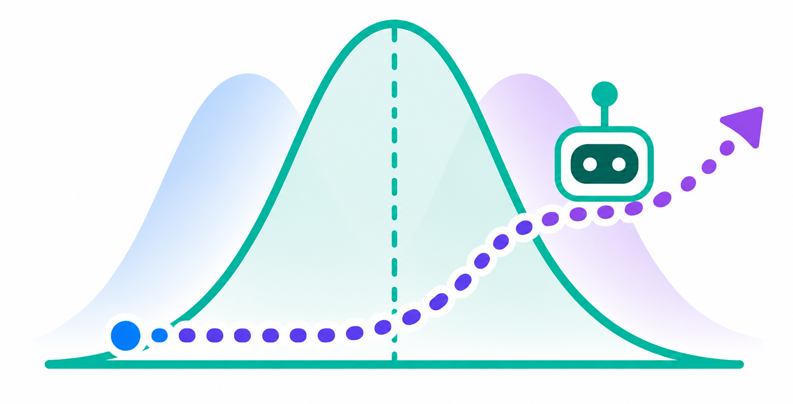
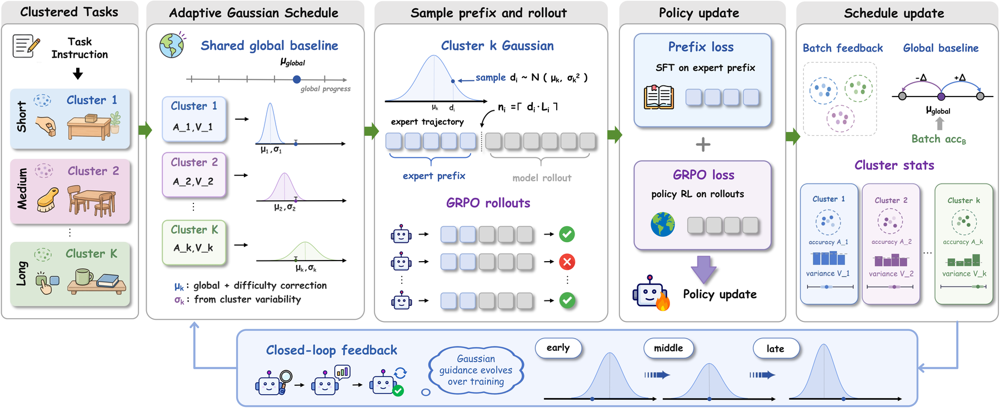
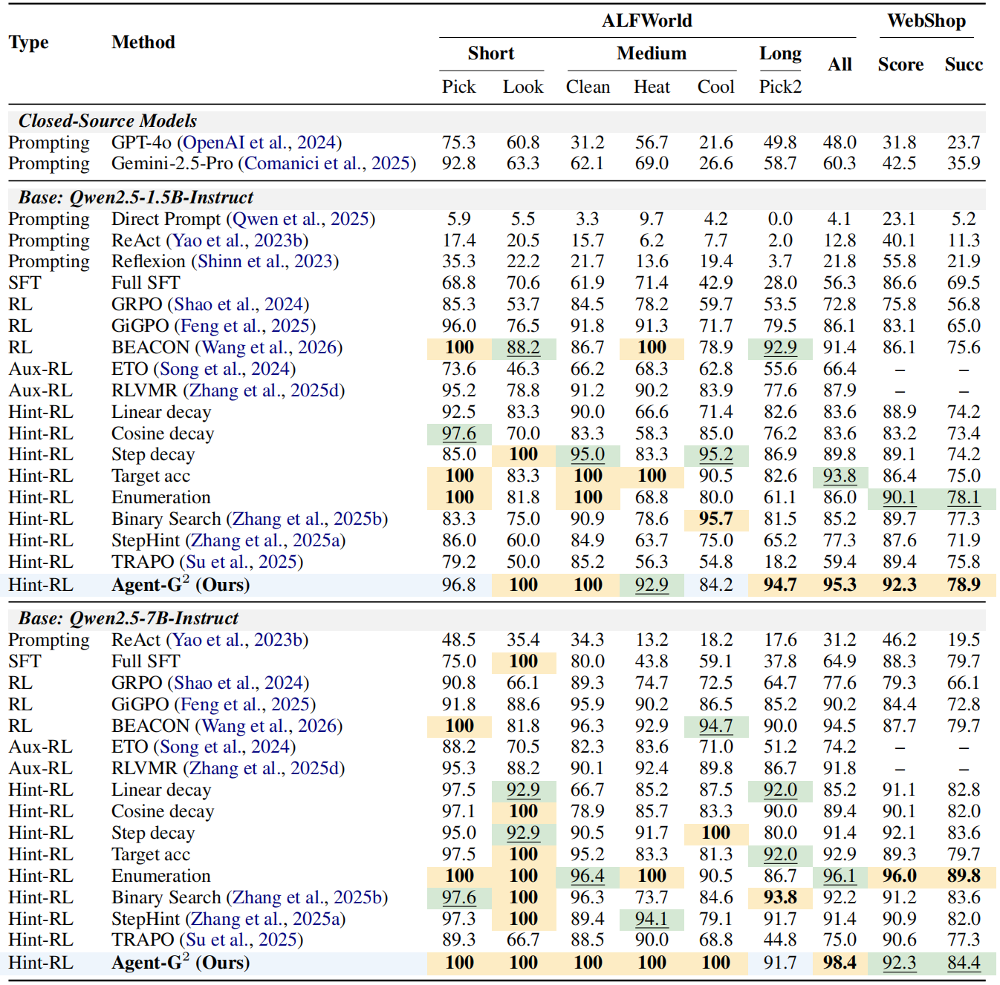

<h1 align="center">
  <br>
  Agent-G²
</h1>
<h3 align="center"><em><ins>G</ins>aussian <ins>G</ins>uidance for Agentic Reinforcement Learning</em></h3>

<p align="center">
  <a href="#"></a>
  <a href="https://zju-real.github.io/Agent-G2/"></a>
  <a href="https://huggingface.co/collections/xiamoent/agent-g2"></a>
  <a href="https://huggingface.co/datasets/xiamoent/Agent-G2-ALFWorld-Webshop-sft-data"></a>
</p>

<p align="center">
  Zixuan Wang<sup>1,2*</sup>, Yanrui Miao<sup>1,3*</sup>, Zhengxi Lu<sup>1</sup>, Teng Pan<sup>1,2</sup>,
  Yiwen Qiu<sup>1</sup>, Hongxing Li<sup>1</sup>, Peng Qiu<sup>2</sup><br>
  Ruiqing Zhang<sup>2</sup>, Yongliang Shen<sup>1&dagger;</sup>
</p>

<p align="center">
  <sup>1</sup> Zhejiang University &nbsp;&nbsp;&middot;&nbsp;&nbsp;
  <sup>2</sup> Baidu Inc. &nbsp;&nbsp;&middot;&nbsp;&nbsp;
  <sup>3</sup> Shandong University<br>
  <sup>*</sup> Equal contribution &nbsp;&nbsp;&middot;&nbsp;&nbsp;
  <sup>&dagger;</sup> Corresponding author
</p>


## 🎉 News
- **2026.08.23:**  We release our paper, code, and dataset.
- **2026.08.21:**  Our paper has been accepted at EMNLP 2026 Main Conference 🎉🎉🎉!

## 📝 Abstract
Hint-based reinforcement learning addresses reward sparsity in long-horizon agentic tasks by retaining a prefix of an expert trajectory before each rollout, letting the policy explore from a state closer to success. Its effectiveness hinges on the guidance depth: how much of the trajectory to keep. Existing methods treat this depth as a deterministic scalar. Scheduled approaches share one value across samples and ignore per-task heterogeneity, while per-sample probing estimates it separately at the cost of extra rollouts. We find that useful guidance occupies a band of depths whose informativeness profile is approximately Gaussian around the band center. Agent-G² draws the depth per task from a Gaussian whose center and spread are estimated online from rollouts already collected for policy optimization, requiring no probe rollouts or learned depth predictor. On ALFWorld and WebShop with Qwen2.5-1.5B / 7B-Instruct, Agent-G² consistently improves over strong hint-based, hint-free, and auxiliary-RL baselines. It achieves 95.3% / 98.4% success on ALFWorld and a 92.3 reward score on WebShop at both model scales, with 78.9% / 84.4% final-purchase success.

## 🌟 Highlights

- **Gaussian guidance instead of scalar scheduling.** Agent-G² models useful
  hint depths as an informative neighborhood rather than a single deterministic
  prefix length.
- **No probe rollouts.** The guidance distribution is estimated from existing
  rollout statistics, avoiding the extra rollout cost of per-sample probing.
- **Strong long-horizon performance.** Agent-G² reaches 95.3% / 98.4% success on
  ALFWorld with Qwen2.5-1.5B / 7B-Instruct, and 92.3 WebShop reward score at both
  scales.
- **Beyond imitation.** Prefix SFT alone is not enough; the gains come from
  combining expert-prefix guidance with post-prefix RL rollouts.

## 🤖 Method

<p align="center">
  
</p>

Agent-G² operates in four stages:

1. **Task clustering.** Tasks are grouped by expert-trajectory length, which acts
   as a lightweight difficulty signal.
2. **Gaussian schedule estimation.** A global guidance baseline is combined with
   per-cluster success and variance statistics collected from previous batches.
3. **Per-task prefix sampling.** For each task, Agent-G² samples a guidance ratio
   and executes the corresponding expert prefix before policy rollout.
4. **Joint policy and schedule update.** GRPO updates the policy from post-prefix
   rollouts, while the same terminal rewards refresh the guidance distribution
   for the next batch.

## 🎉 Performance
<p align="center">
  
</p>
Agent-G² consistently improves long-horizon agent learning across both ALFWorld and WebShop. It achieves strong task-wise success on ALFWorld while matching or surpassing competitive hint-based, hint-free, and auxiliary-RL baselines. On WebShop, Agent-G² remains highly effective at both model scales without relying on extra probe rollouts, showing that adaptive Gaussian guidance can provide task-specific exploration at lower rollout cost.

## 🔖 Repository Layout

```text
gmsv/                   # Agent-G² core: Gaussian schedule and prefix runtime
examples/gmsv_trainer/  # Paper training scripts for ALFWorld and WebShop
sft_data/               # Expert trajectories used as hint prefixes
agent_system/           # ALFWorld and WebShop environment integrations
```

Everything else is inherited from the upstream `verl-agent` framework or kept as
baseline/reproduction utilities.

## 📦 Installation

We recommend using separate environments for the base framework and WebShop,
because WebShop has stricter Python-version requirements.

### 1. Base Framework

```bash
conda create -n verl-agent python==3.12 -y
conda activate verl-agent

pip3 install torch==2.6.0 --index-url https://download.pytorch.org/whl/cu124
pip3 install flash-attn==2.7.4.post1 --no-build-isolation
pip3 install -e .
pip3 install vllm==0.8.5
```

### 2. ALFWorld

```bash
pip3 install gymnasium==0.29.1
pip3 install stable-baselines3==2.6.0
pip install alfworld
pip install vllm==0.8.5

# Download PDDL, game files, and the pretrained MaskRCNN detector.
alfworld-download -f
```

### 3. WebShop

WebShop requires Python <= 3.10:

```bash
conda create -n verl-agent-webshop python==3.10 -y
conda activate verl-agent-webshop

cd ./agent_system/environments/env_package/webshop/webshop
./setup.sh -d all

cd repo_root/
pip3 install torch==2.6.0 --index-url https://download.pytorch.org/whl/cu124
pip3 install flash-attn==2.7.4.post1 --no-build-isolation
pip3 install -e .
pip3 install vllm==0.8.2
```

## 🚀 Training

Paper-locked training scripts (Qwen2.5-1.5B-Instruct, single 8-GPU node) live in [`examples/gmsv_trainer/`](./examples/gmsv_trainer/):

```bash
bash examples/gmsv_trainer/run_alfworld.sh    # ALFWorld
bash examples/gmsv_trainer/run_webshop.sh     # WebShop
```

## 📊 Baselines

This repository also includes reproduction paths for hint-based, hint-free, and
probing baselines:

```text
examples/grpo_trainer/          # GRPO without expert hints
examples/gigpo_trainer/         # GiGPO baseline
examples/liner_hint_trainer/    # Linear schedule
examples/cosine_hint/           # Cosine schedule
examples/fix_step_hint_trainer/ # Fixed-step schedule
examples/fix_acc_hint_trainer/  # Target-accuracy schedule
examples/binary_search/         # Probe-based binary search
examples/enumerate_hint/        # Probe-based enumeration
stephint/                       # StepHint reproduction path
trapo/                          # TraPO reproduction path
```

## 🙏 Acknowledgement

This codebase builds on [verl-agent](https://github.com/langfengQ/verl-agent), which itself extends [veRL](https://github.com/volcengine/verl). We thank the authors of those projects, and the maintainers of the supported environments — [ALFWorld](https://github.com/alfworld/alfworld) and [WebShop](https://github.com/princeton-nlp/WebShop).


## ⭐️ Citation

If you find this project useful, welcome to cite us.

```bibtex
@misc{wang2026agentg2,
  title  = {Agent-G²: Gaussian Guidance for Agentic Reinforcement Learning},
  author = {Zixuan Wang and Yanrui Miao and Zhengxi Lu and Teng Pan and Yiwen Qiu
            and Hongxing Li and Peng Qiu and Ruiqing Zhang and Yongliang Shen},
  year   = {2026},
  note   = {Accepted at EMNLP 2026 Main Conference},
}

@misc{wang2026milestoneguidedpolicylearninglonghorizon,
  title         = {Milestone-Guided Policy Learning for Long-Horizon Language Agents},
  author        = {Zixuan Wang and Yuchen Yan and Hongxing Li and Teng Pan and Dingming Li and Ruiqing Zhang and Weiming Lu and Jun Xiao and Yueting Zhuang and Yongliang Shen},
  year          = {2026},
  eprint        = {2605.06078},
  archivePrefix = {arXiv},
  primaryClass  = {cs.CL},
  url           = {https://arxiv.org/abs/2605.06078},
}

@article{lu2026skill0,
  title   = {Skill0: In-context agentic reinforcement learning for skill internalization},
  author  = {Lu, Zhengxi and Yao, Zhiyuan and Wu, Jinyang and Han, Chengcheng and Gu, Qi and Cai, Xunliang and Lu, Weiming and Xiao, Jun and Zhuang, Yueting and Shen, Yongliang},
  journal = {arXiv preprint arXiv:2604.02268},
  year    = {2026},
}

@article{lu2026sdar,
  title   = {Self-distilled agentic reinforcement learning},
  author  = {Lu, Zhengxi and Yao, Zhiyuan and Han, Zhuowen and Wang, Zi-Han and Wu, Jinyang and Gu, Qi and Cai, Xunliang and Lu, Weiming and Xiao, Jun and Zhuang, Yueting and others},
  journal = {arXiv preprint arXiv:2605.15155},
  year    = {2026},
}
```
